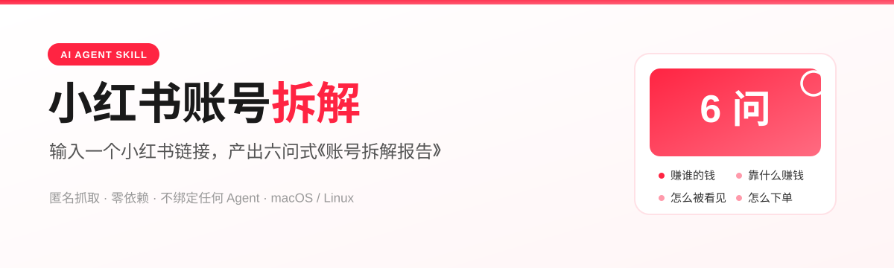
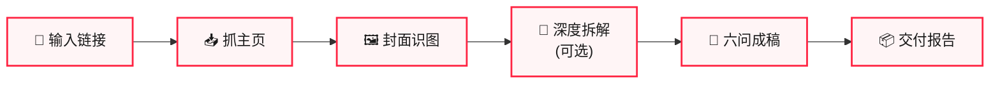

<p align="right">
  <a href="README_EN.md">English</a>
</p>

<p align="center">
  
</p>

<p align="center">
  
  &nbsp;
  
  &nbsp;
  
  &nbsp;
  
  &nbsp;
  
</p>

# 小红书账号拆解

> [!NOTE]
> **一个 AI Agent Skill，标准 `SKILL.md` 格式。** 输入一个小红书账号链接，匿名抓取主页与笔记列表、下载封面并识图，按六问式拆解结构产出《账号拆解报告》。
>
> **不绑定任何特定厂商** —— 任何能读 `SKILL.md`、能执行 shell、能识别图片的 Agent 都能用；也可以完全不接 Agent，直接跑两个脚本自己看图。
>
> 无需登录、无需 Cookie、无需后端服务。只依赖 `python3` 与 `curl`。

## 社群 / Community

想加入自媒体 AI 破局社群，可联系微信：`JZX_AI1203`。

---

## 它能干什么

| 能力 | 说明 |
|---|---|
| 📥 **匿名抓主页** | 手机 UA 抓账号 SSR，拿到用户信息 + 第一页笔记列表 + 封面图 |
| 🖼️ **封面识图拆解** | 逐张读封面，提取栏目期号、被拆对象截图字段、品类、客单价、销量、钩子句、点睛句 |
| 📖 **深度拆解**（可选） | 用户提供带 `xsec_token` 的笔记链接后，逐页识图还原完整论证链 |
| 📐 **六问式成稿** | 按 `references/teardown-framework.md` 的框架产出结构化《账号拆解报告》 |

## 宿主能力要求

判断你的工具能不能用，对照这张表即可：

| 能力 | 用途 | 缺失时的降级 |
|---|---|---|
| 执行 shell 命令 | 运行两个抓取脚本（内部调用 `curl`） | 只当方法论框架用，照 `references/teardown-framework.md` 手工拆解 |
| 读取本地图片（视觉） | 识别封面与笔记内页的截图字段、正文、金句 | 只能拿到 `profile.json`/`notes_list.json` 数据骨架，识图部分标「未获取」 |
| 写文件 | 落地报告与抓取的图片、JSON | 改为在对话里直接输出报告正文 |

三项都具备才能得到完整报告。

---

## 快速开始

### 安装

按你用的工具选一个 skills 目录，把本仓库复制或软链过去：

| 工具 | 目录 |
|---|---|
| Claude Code（全局） | `~/.claude/skills/` |
| Claude Code（项目级） | `<你的项目>/.claude/skills/` |
| QwenWork | `~/.qwenworkcn/skills/` |
| OpenClaw 及其他兼容 `SKILL.md` 的平台 | 各自的 skills 目录 |

```bash
ln -s /path/to/xhs-account-teardown ~/.claude/skills/xhs-account-teardown
```

之后对 Agent 说「拆解这个账号 <链接>」即可触发。

> **工具不支持 `SKILL.md`**（只吃 rules / system prompt 的编辑器）：把 `SKILL.md` 正文贴进规则文件，`references/teardown-framework.md` 与 `templates/report-template.md` 一并提供，脚本手动调用。本 skill 的价值主要在框架文档里，不依赖特定加载机制。
>
> **完全不用 Agent**：直接跑两个脚本拿数据，自己看图，照模板写报告。见下文「用法」。

### 用法

抓主页：

```bash
python3 scripts/fetch_profile.py "https://www.xiaohongshu.com/user/profile/<user_id>" -o ./work/<账号名>/
```

链接里的 `xsec_token` 可缺省，主页列表匿名可抓。产出 `profile.json`、`notes_list.json`、`covers/cover1..N.jpg`。

抓单条笔记详情（需要带 token 的链接）：

```bash
python3 scripts/fetch_note.py "https://www.xiaohongshu.com/explore/<noteId>?xsec_token=...&xsec_source=..." -o ./work/<账号名>/notes/<noteId>/
```

产出 `meta.json`、`desc.md`、`img1..N.jpg`。

> [!WARNING]
> 封面下载是**串行限速**的。同一 IP 高频请求会触发风控，**失败时不要无限重试** —— 风控是 IP 级的，重试只会延长封锁。

---

## 完整工作流



1. **解析链接** —— 提取 `user_id` 与 `xsec_token`
2. **抓主页** —— `fetch_profile.py` → 笔记列表 + 封面
3. **封面识图** —— 用视觉能力逐张读封面，登记：栏目期号、被拆对象截图字段（昵称/评分/已售/粉丝/更新频率/售后标签）、品类、客单价、橱窗销量、钩子句、点睛句
4. **深度拆解（可选）** —— 对用户给的带 token 笔记链接跑 `fetch_note.py`，逐页识图转录正文与截图字段
5. **六问成稿** —— 按 `references/teardown-framework.md` 的六问 + `templates/report-template.md` 成报告
6. **交付** —— 报告 + 封面目录表 + 数据缺口说明

---

## 能抓什么，不能抓什么

> [!IMPORTANT]
> 这是本仓库**最重要的部分**。小红书匿名访问的边界比多数人以为的窄 —— **抓不到的数据一律写「未获取」，严禁编造。**

| | 能力 | 说明 |
|---|---|---|
| ✅ 可匿名抓 | 账号主页 SSR | 手机 UA `curl /user/profile/<id>`，解析 `window.__INITIAL_STATE__` |
| ✅ 可匿名抓 | 用户信息 | 昵称、redId、简介、粉丝、关注、赞藏、合集名 |
| ✅ 可匿名抓 | 第一页笔记列表 | **上限 8 篇**，含 id/标题/类型/赞/藏/评/是否置顶 |
| ✅ 可匿名抓 | 笔记封面图 | CDN 签名直链，可直接下载 |
| ✅ 可抓（需 token） | 单条笔记详情 | 正文、标签、互动数据、全部图片 |
| ❌ 不可匿名抓 | 笔记详情 | `/discovery/item/<noteId>` 的 SSR 要求**笔记级 xsec_token** |
| ❌ 不可匿名抓 | 第二页及以后的笔记列表 | 需要 `x-s` 签名 |
| ❌ 不可匿名抓 | 搜索、评论、feed 流 | 需要 `x-s` 签名或登录态 |

关于 token 的三个坑，都实测过：

1. **token 与笔记绑定。** 从 A 笔记复制的 token 拿去请求 B 笔记，SSR 返回空 `noteData`，不报错、不跳转，就是空。
2. **主页列表里的 id 不能直接拼详情路由。** 主页给的是 32 位 hex id，`/discovery/item/` 需要的是另一个 24 位 noteId，两者不通用。
3. **token 必须从登录态浏览器地址栏整链复制**，包含 `xsec_token` 与 `xsec_source` 两个参数。

所以默认交付是「主页画像 + 封面级拆解」。要做全文级拆解，必须由人提供带 token 的笔记链接。

---

## 拆解框架：六问

> [!TIP]
> 蒸馏自一组系列化「小生意拆解」笔记的结构规律：多期封面识图提取模板规律 + 单期全文逐页识图还原完整论证链。

| # | 问题 | 看什么 |
|---|---|---|
| 1 | **这门生意赚的是谁的钱？** | 需求侧：人群画像、真实动机、触发场景、决策关注点 |
| 2 | **具体靠什么赚钱？** | 价格带、爆款拉新品、组合装、满减凑单、多 SKU |
| 3 | **怎么让人看见并且想买？** | 内容形式、视觉资产、标题公式、内容链路 |
| 4 | **看完之后怎么让人下单？** | 站内链路、券与凑单、信任资产（评分/好评率/发货/售后） |
| 5 | **普通人能不能学？** | 为什么跑通 / 轻资产档 vs 重资产档 / 可抄三板斧 |
| 6 | **最大的风险是什么？** | 退货率、履约成本、同质化价格战、库存 |

每一问以一句加粗「一句话公式」收尾，例如：**低价负责拉人，多款负责留人，满减负责让人多买**。全文结尾固定三段：能抄的 / 抄不了的 / 最大的坑。

框架原本用于拆「卖货账号」，`references/teardown-framework.md` 文末给了拆「任意内容账号」时的字段替换表（品类→内容赛道，赚谁的钱→赚谁的注意力与信任，等等）。

---

## 仓库结构

```
SKILL.md                              Skill 定义：触发词、工作流、宿主能力要求、抓取边界、报告硬约束
AGENTS.md                             给任意 AI 工具的仓库工作说明（含硬约束与隐私约束）
CLAUDE.md                             兼容入口，指向 AGENTS.md
scripts/fetch_profile.py              主页抓取（匿名 SSR）
scripts/fetch_note.py                 单笔记抓取（需笔记级 xsec_token）
references/teardown-framework.md      六问拆解框架 + 任意账号字段替换表
templates/report-template.md          报告空模板
assets/                               README 视觉资产（banner + 离线徽章）
```

## 关于样例

框架是从真实账号的拆解产物里蒸馏出来的，但**完整成稿样例（逐页识图记录、封面目录、被拆账号名与经营数据）不随本仓库分发** —— 那些内容含真实第三方账号信息，公开不合适。

`references/teardown-framework.md` 本身已脱敏：只保留六问结构、每问要看哪些信息位、以及公式骨架，不含任何账号名、ID、销量、评分、价格或原文摘录。

想要一份端到端的样例报告，挑一个自己有权分析的账号跑一遍工作流即可。

## 与其他小红书工具的边界

本仓库只做**匿名轻量抓取 + 拆解报告框架**。如果需要搜索笔记、登录态批量采集、发布内容、评论点赞互动，请用第三方的 `xiaohongshu-skills` 项目（含 `xhs-auth` / `xhs-explore` / `xhs-publish` / `xhs-interact` / `xhs-content-ops` 五个子技能，走已登录浏览器操作真实账号），不要在这里重复实现。

## 依赖

- Python 3.9+（仅标准库，无需虚拟环境）
- `curl`

无需安装任何第三方包。

macOS 与 Linux 开箱可用。Windows 上 `curl` 自 Win10 起内置，但 `python3` 命令名常常不存在（多为 `python` 或 `py`）—— 在 WSL / Git Bash 里跑最省事，或把两个脚本里的 `"curl"` 与调用命令按本机情况调整。

## License

[MIT](LICENSE)
