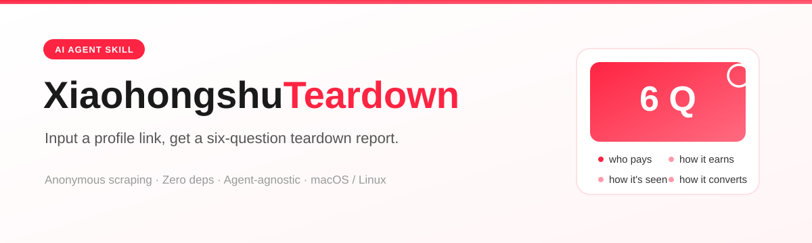
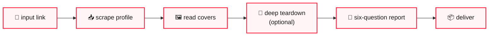

<p align="right">
  <a href="README.md">中文</a>
</p>

<p align="center">
  
</p>

<p align="center">
  
  &nbsp;
  
  &nbsp;
  
  &nbsp;
  
  &nbsp;
  
</p>

# Xiaohongshu Account Teardown

> [!NOTE]
> **An AI agent skill in standard `SKILL.md` format.** Feed it a Xiaohongshu profile link and it anonymously scrapes the profile and note list, downloads covers, reads the images, and produces a structured *Account Teardown Report* following a six-question framework.
>
> **Not tied to any vendor** — any agent that can read `SKILL.md`, run a shell, and recognize images works. Or skip the agent entirely and run the two scripts yourself.
>
> No login, no cookies, no backend. Depends only on `python3` and `curl`.

---

## What it does

| Capability | Description |
|---|---|
| 📥 **Anonymous profile scraping** | Mobile UA fetch of the profile SSR — user info + first-page note list + cover images |
| 🖼️ **Cover-image teardown** | Read each cover to extract the series issue number, screenshot fields, category, price, sales, hook line, punchline |
| 📖 **Deep teardown** (optional) | With a user-supplied `xsec_token` note link, transcribe the full note page by page |
| 📐 **Six-question report** | Produce a structured report following `references/teardown-framework.md` |

## Host capability requirements

Check this table to see if your tool qualifies:

| Capability | Used for | Fallback if missing |
|---|---|---|
| Run shell commands | Run the two scraping scripts (which call `curl`) | Use as a methodology framework only; teardown manually per `references/teardown-framework.md` |
| Read local images (vision) | Recognize screenshot fields, body text, and punchlines on covers and note pages | Only get the `profile.json`/`notes_list.json` data skeleton; mark image reads as "not obtained" |
| Write files | Save the report and scraped images / JSON | Output the report body directly in conversation instead |

All three are required for a complete report.

---

## Quick start

### Install

Pick a skills directory for your tool and copy or symlink this repo into it:

| Tool | Directory |
|---|---|
| Claude Code (global) | `~/.claude/skills/` |
| Claude Code (project) | `<your-project>/.claude/skills/` |
| QwenWork | `~/.qwenworkcn/skills/` |
| OpenClaw & other `SKILL.md`-compatible platforms | their own skills directories |

```bash
ln -s /path/to/xhs-account-teardown ~/.claude/skills/xhs-account-teardown
```

Then tell the agent "teardown this account <link>" to trigger it.

> **Tool doesn't support `SKILL.md`** (only consumes rules / system prompts): paste the `SKILL.md` body into your rules file, provide `references/teardown-framework.md` and `templates/report-template.md` alongside, and call the scripts manually. The skill's value lives in the framework doc, not any specific loading mechanism.
>
> **No agent at all**: run the two scripts, read the images yourself, and write the report from the template. See "Usage" below.

### Usage

Scrape a profile:

```bash
python3 scripts/fetch_profile.py "https://www.xiaohongshu.com/user/profile/<user_id>" -o ./work/<account>/
```

The `xsec_token` in the link is optional — the profile list is anonymously scrapable. Produces `profile.json`, `notes_list.json`, `covers/cover1..N.jpg`.

Scrape a single note's details (needs a token link):

```bash
python3 scripts/fetch_note.py "https://www.xiaohongshu.com/explore/<noteId>?xsec_token=...&xsec_source=..." -o ./work/<account>/notes/<noteId>/
```

Produces `meta.json`, `desc.md`, `img1..N.jpg`.

> [!WARNING]
> Cover downloads are **rate-limited serially**. High-frequency requests from one IP trigger anti-scraping controls — **do not retry endlessly on failure**: the block is IP-level, and retrying only prolongs it.

---

## Full workflow



1. **Parse the link** — extract `user_id` and `xsec_token`
2. **Scrape the profile** — `fetch_profile.py` → note list + covers
3. **Read covers** — use vision to read each cover and record: series issue number, screenshot fields (nickname/rating/sold/followers/update cadence/after-sales tags), category, price, showcase sales, hook line, punchline
4. **Deep teardown (optional)** — run `fetch_note.py` on user-supplied token links, transcribe body text and screenshot fields page by page
5. **Write the report** — follow the six questions in `references/teardown-framework.md` + `templates/report-template.md`
6. **Deliver** — report + cover directory + data-gap notes

---

## What can and can't be scraped

> [!IMPORTANT]
> This is the **most important part** of this repo. Xiaohongshu's anonymous-access boundary is narrower than most people assume — **anything not obtained must be written as "not obtained", never fabricated.**

| | Capability | Notes |
|---|---|---|
| ✅ Anonymous | Profile SSR | Mobile UA `curl /user/profile/<id>`, parse `window.__INITIAL_STATE__` |
| ✅ Anonymous | User info | nickname, redId, bio, followers, following, likes & collects, collection names |
| ✅ Anonymous | First-page note list | **max 8 notes**, with id/title/type/likes/collects/comments/pinned |
| ✅ Anonymous | Note cover images | CDN signed direct links, directly downloadable |
| ✅ With token | Single note details | body, tags, engagement data, all images |
| ❌ Not anonymous | Note details | `/discovery/item/<noteId>` SSR requires a **note-level xsec_token** |
| ❌ Not anonymous | Second page onward | requires `x-s` signature |
| ❌ Not anonymous | Search, comments, feed | requires `x-s` signature or a logged-in session |

Three token pitfalls, all verified in practice:

1. **Tokens are note-bound.** A token copied from note A, used on note B, returns an empty `noteData` — no error, no redirect, just empty.
2. **Profile-list ids can't be pasted into the detail route.** The profile gives a 32-char hex id; `/discovery/item/` needs a different 24-char noteId. They're not interchangeable.
3. **The token must be copied whole from a logged-in browser's address bar**, including both `xsec_token` and `xsec_source`.

So the default deliverable is "profile portrait + cover-level teardown". Full-text teardown requires the user to provide token links.

---

## The six-question framework

> [!TIP]
> Distilled from the structural patterns of a series of "small-business teardown" notes: cover-image reading extracts template patterns across issues, while full-text reading reconstructs the complete argument chain.

| # | Question | What to examine |
|---|---|---|
| 1 | **Whose money does this business make?** | Demand side: audience profile, real motivation, trigger scenario, decision concerns |
| 2 | **How exactly does it make money?** | price band, hero SKU, bundles, coupon thresholds, multi-SKU |
| 3 | **How does it get seen and wanted?** | content format, visual assets, title formula, content chain |
| 4 | **How does it convert after being seen?** | in-app funnel, coupons & bundling, trust assets (rating/review rate/shipping/after-sales) |
| 5 | **Can an ordinary person copy it?** | why it works / light-asset vs heavy-asset / the copyable moves |
| 6 | **What's the biggest risk?** | return rate, fulfillment cost, homogenized price war, inventory |

Each question ends with a bold one-line formula, e.g. **low price pulls people in, many SKUs keep them, coupons make them buy more**. The report closes with three fixed sections: what to copy / what can't be copied / the biggest pitfall.

The framework was originally built to tear down "selling" accounts. `references/teardown-framework.md` ends with a field-mapping table for tearing down "any content account" (category → content track, whose money → whose attention and trust, etc.).

---

## Known data pitfalls

> [!WARNING]
> The following were verified against real SSR payloads and are **not yet handled by the scripts**. Keep them in mind when writing reports by hand:

- **Inconsistent number types.** In the profile list, `likes` is a thousands-separated string (e.g. `"1,234"`), while `collects`/`comments` are ints; in user info, `likeAndCollect` is a Chinese-unit string (e.g. `"1.2万"`). Normalize before sorting, comparing, or computing hit rates.
- **The profile's `collects` can be a fake 0.** We've seen a pinned note return `collects: 0` from the profile while the same note's details show four-digit collects; `likes` and `comments` matched between profile and details — only `collects` was off. **When profile numbers conflict with note details, trust the details and note the discrepancy in the report.**
- **`profile.json` drops some fields.** The SSR `userInfo` also contains `ipLocation`, `tags`, `redOfficialVerifyInfo`, `userRoleType`, `images` (avatar), and `collectionList`, which the script currently doesn't save. These are useful for portraits — patch the script or parse your own saved HTML if needed.

---

## Repo structure

```
SKILL.md                              Skill definition: triggers, workflow, host requirements, scraping boundary, report constraints
AGENTS.md                             Working notes for any AI tool (hard constraints & privacy constraints)
CLAUDE.md                             Compat entry, points to AGENTS.md
scripts/fetch_profile.py              Profile scraper (anonymous SSR)
scripts/fetch_note.py                 Single-note scraper (needs note-level xsec_token)
references/teardown-framework.md      Six-question framework + field-mapping table for any account
templates/report-template.md          Empty report template
assets/                               README visual assets (banners + offline badges)
```

## About samples

The framework is distilled from real-account teardown outputs, but **the full sample reports (page-by-page image reads, cover directories, the torn-down account names and business numbers) are not distributed with this repo** — they contain real third-party account info and shouldn't be public.

`references/teardown-framework.md` is already de-identified: it keeps only the six-question structure, the information slots to check per question, and the formula skeletons — no account names, ids, sales, ratings, prices, or original excerpts.

For an end-to-end sample report, run the workflow on an account you're authorized to analyze.

## Boundaries with other Xiaohongshu tools

This repo only does **anonymous lightweight scraping + a teardown report framework**. For searching notes, logged-in batch collection, publishing content, or like/comment interaction, use the third-party `xiaohongshu-skills` project (five sub-skills: `xhs-auth` / `xhs-explore` / `xhs-publish` / `xhs-interact` / `xhs-content-ops`, operating a real account through a logged-in browser) — don't reimplement those here.

## Dependencies

- Python 3.9+ (standard library only, no venv needed)
- `curl`

No third-party packages required.

Works out of the box on macOS and Linux. On Windows, `curl` is built in since Win10, but the `python3` command often doesn't exist (usually `python` or `py`) — running under WSL / Git Bash is easiest, or adjust the `"curl"` and invocation commands in the two scripts to match your setup.

## License

[MIT](LICENSE)
